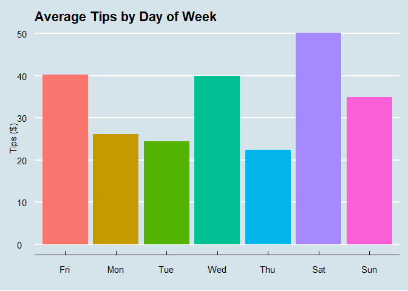
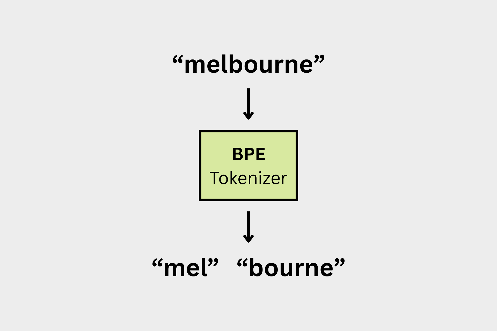

## **Hi, I'm Saumi.** 
:::{layout-ncol=2}
:::{#first-column}

I graduated from UBC with a Master's of Data Science - Computational Linguistics in June 2026. Before that, I finished my undergraduate studies at SFU in Honours Philosophy, with a minor in Social Data Analytics. 

You can find my most up to date CV [here](SaumiRahnamay_cv.pdf).
:::

:::{#second-column}
{width="250px"}
:::

:::

## Featured Work

::: {layout-ncol=3}

::: {#first-card} 
#### [Optimizing Gratuity](projects/Optimizing_Gratuitiy.qmd)

Analysis of day-of-week and precipitation levels on tip amounts from my part-time pizza delivery job. 

{width="200px"}

Demonstrated a 106.16% increase in expected tips; demonstrated the effect of preset tip percentage options on expected tip. 

Inferential statistics performed with R.
:::

::: {#second-card}
#### [Super Smash Brothers Player Statistics](projects/Melee-SQL.qmd)
Analysis of my own player statistics in the fighting game Super Smash Brothers Melee. 

Determining where my play needs improvement, and optimizing my tournament strategy.

EDA performed in SQL.
:::

::: {#second-card}
#### [BPE Tokenizer from Scratch](projects/bpe-tokenizer-from-scratch.ipynb)
Coding a Byte-Pair Encoding Tokenizer from scratch; only using numpy. Tokenization is the first step of any machine learning application involving natural language (e.g. LLMs).

{width="200px"}

First entry in an ongoing series of 'from scratch' coding projects.
:::

:::

[View all projects →](projects.qmd)
