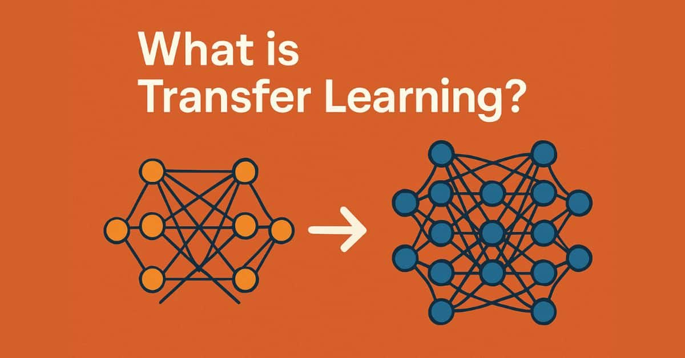

A small full-stack project that builds a **named-entity recognizer (NER)** for a lower-resource language by transferring knowledge from a high-resource one. A Python linguistics backend (spaCy) trains and serves the model; a C#/Blazor frontend lets you paste text and see the entities it finds.


::: {.callout-note title="Disclaimers"}
- This demo uses an open, annotated **Danish** dataset. Danish is *not* an endangered or   genuinely low-resource language; it simply has *less* annotated data than English,  which makes it a convenient stand-in. The point is the **technique**: train where data is plentiful (English), then fine-tune on the language you actually care about.
- The backend code is a repurposed assignment from COLX 581 at UBC.
- Frontend and documentation were created in collaboration with AI.
:::

## Try it live

The trained model runs in a Hugging Face Space — paste Danish text below and it highlights the entities it finds. (The Space sleeps when idle, so the first request after a while may take ~30s to wake up.)

```{=html}
<iframe
  src="https://saumirah-lowresource-ner-danish.hf.space"
  title="Low-Resource NER live demo"
  frameborder="0"
  width="100%"
  height="640"
  style="border:1px solid #ddd; border-radius:8px;">
</iframe>
<p style="font-size:0.85em;">
  Demo not loading?
  <a href="https://huggingface.co/spaces/saumirah/lowresource-ner-danish" target="_blank" rel="noopener">Open it directly on Hugging Face ↗</a>
</p>
```

## Effect of Transfer Learning 

| Model | How it's trained | Danish test F1 |
|---|---|---|
| **Baseline** | Danish data only (272 sentences) | _49.26_ |
| **Transfer** | Pretrain on English (CoNLL-2003), then fine-tune on the same 272 Danish sentences | _51.44_ |

The transfer model wins because most of what NER needs — what a name looks like, where entities sit in a sentence — is **learned from the English data** and carries over, even though English and Danish vocabularies differ.

## Architecture

```
┌─────────────────────┐    HTTP/JSON     ┌──────────────────────┐
│  Blazor WebAssembly │  ───────────────▶│  FastAPI  (app.py)   │
│  (frontend/)        │   POST /annotate │   loads cached model │
│  entity highlighter │ ◀─────────────── │          │           │
└─────────────────────┘                  │          ▼           │
                                         │  spaCy NER (nercore) │
                                         │  models/transfer-da  │
                                         └──────────────────────┘
```

- **`backend/nercore/`** — the linguistics core: `data.py` (CoNLL/BIO parsing → spaCy format), `evaluation.py` (corpus precision/recall/F1), `modeling.py` (`init_model`, `train` with best-model pocketing, `retrain` for fine-tuning, `annotate`).
- **`backend/scripts/train.py`** — runs the baseline + transfer pipeline once and caches `models/transfer-da/` plus `models/metrics.json`.
- **`backend/app.py`** — FastAPI service exposing `GET /health`, `GET /info`, `POST /annotate`.
- **`frontend/`** — Blazor WebAssembly highlighter that calls the API.

## How transfer learning is wired up

The pipeline trains in two stages and pockets the best model from each:

```python
# 1. Baseline: Danish only
baseline = init_model(labels)
train(baseline, danish_train, danish_dev, epochs=10)

# 2. Transfer: pretrain on English, then fine-tune on the same Danish data
transfer = init_model(labels)
train(transfer, english_train, english_dev, epochs=5)   # high-resource pretraining
retrain(transfer, danish_train, danish_dev, epochs=10)  # low-resource fine-tuning

# 3. Both are scored on the held-out Danish test set
score(baseline, danish_test)   # F1 49.26
score(transfer, danish_test)   # F1 51.44
```

## Why this matters

The same recipe applies to genuinely low-resource and languages, where annotated data is scarce or non-existent: train where data is plentiful, then carry the structural knowledge over with a small amount of in-language fine-tuning. Danish here is only a convenient, openly licensed proxy.

## Code

The full project (backend, frontend, data and tests) lives on GitHub: [**SaumiRah/lowresource-ner**](https://github.com/SaumiRah/lowresource-ner).
